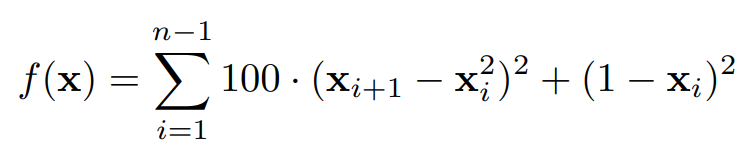
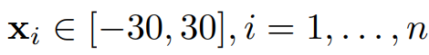
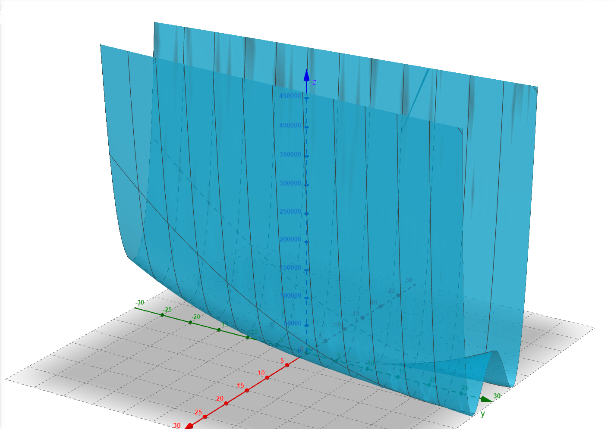
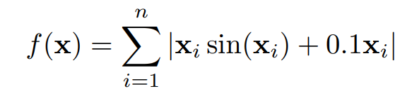
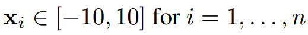
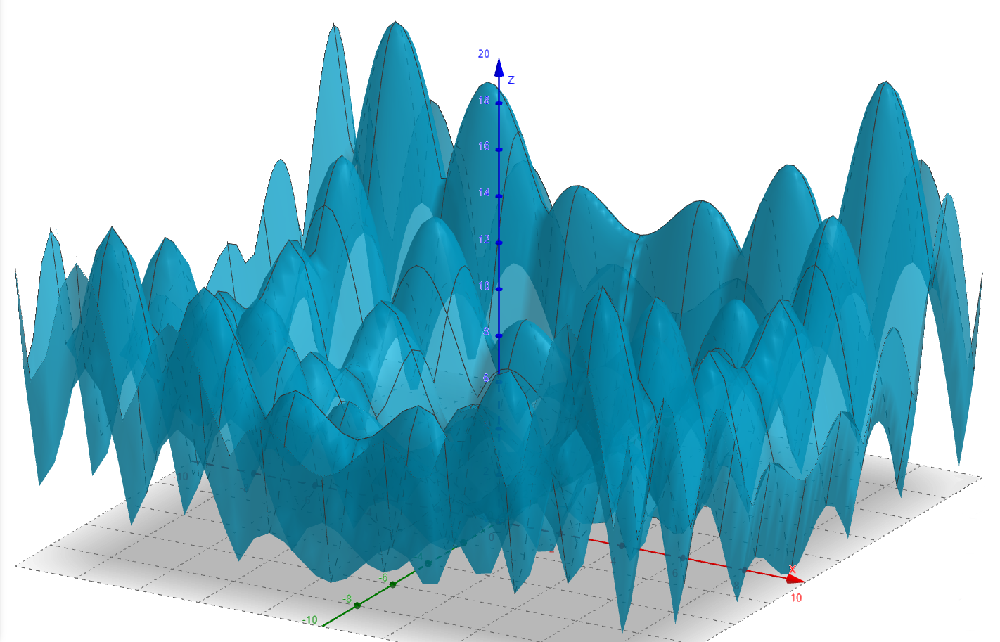

# Porównanie Algorytmów Minimalizacji Stochastycznej

## Dawid Zawiślak, Jakub Worek

16 stycznia 2024r.

## 1. Wstęp

Poniższe sprawozdanie prezentuje rezultaty i wnioski uzyskane w ramach projektu, którego celem było przeprowadzenie analizy statystycznej porównania efektywności wybranych algorytmów minimalizacji stochastycznej. Badania obejmują dwie metody: PRS (Pure Random Search/Poszukiwanie Przypadkowe) oraz GA (Genetic Algorithm/Algorytm Genetyczny). Obie metody zostały przetestowane na funkcjach Rosenbrock oraz Alpine01.

### 1.1. Opisy testowanych funkcji

Podczas wykonywania projektu analizowaliśmy dwie funkcje Rosenbrock oraz Alpine01, które mają swoje odpowiedniki dla wymiarów na których chcemy je testować. Dzięki temu, oprócz oceny jakości wyników w konkretnych przypadkach, możliwe było dodatkowe określenie względnego wzrostu lub spadku efektywności wyników w zależności od liczby wymiarów.

#### 1) Rosenbrock

Funkcja Rosenbrocka jest matematyczną funkcją nieliniową używaną w optymalizacji matematycznej. Jej wzór to:

{width="312"}

, gdzie

{width="196" height="25"}

Funkcja ta ma charakterystyczny wygląd w postaci głębokiej i wąskiej doliny, co czyni ją wyzwaniem dla algorytmów optymalizacyjnych, szczególnie w poszukiwaniu globalnego minimum.

{width="822"}

#### 2) Alpine01

Alpine01 jest wielowymiarową, wielomodową funkcją określoną wzorem:

{width="282" height="69"}

, gdzie

{width="196" height="25"}

To funkcja stosowana głównie do oceny efektywności algorytmów optymalizacyjnych. Charakteryzuje się obecnością wielu minimów lokalnych oraz dokładnie jednego minimum globalnego.

{width="671"}

### 1.2. Metody wybrane do analizy

#### 1) Pure Random Search (PRS)

Pure Random Serach (PRS) jest jedną z najprostszych metod do szukania wartości minimalnej. Polega ona na wielokrotnym losowaniu punktów z zadanej przestrzeni i wybraniu najmniejszej z uzyskanych wartości. Wartości dla każdego wymiaru można parametryzować i wybierać według pewnego rozkładu. W kontekście porównań algorytmów minimalizacji stochastycznej, wartości dla każdego wymiaru są wybierane przy użyciu rozkładu jednostajnego.

#### 2) Algorytm genetyczny (GA)

Algorytm genetyczny to rodzaj algorytmu przeszukującego przestrzeń alternatywnych rozwiązań problemu w celu wyszukania rozwiązań najlepszych. Sposób działania algorytmów genetycznych przypomina zjawisko ewolucji biologicznej. Klasyczne algorytmy genetyczne w żaden sposób nie wykorzystują wiedzy o rozwiązywanym problemie. To, że znajdują rozwiązanie wynika z faktu, że do każdej następnej generacji przedostają się lepsze jednostki z generacji poprzedniej, a operatory genetyczne wymieniają informacje zawarte w tych jednostkach tworząc nowe, potencjalnie lepsze rozwiązania.

## 2. Przebieg doświadczenia

### 2.1. Kolejne kroki

Najpierw definiujemy funkcje dla odpowiednich wymiarów oraz generujemy dane. Nastepnie porównujemy dwie metody przeszukiwania stochastycznego (PRS i GA) dla 3 różnych dziedzin:

-   Liczba wymiarów n = 2

-   Liczba wymiarów n = 10

-   Liczba wymiarów n = 20

Każdą metodę przetestowaliśmy 100 razy i wzięliśmy wynik średni zwracanych wartości minimów. Również aby zadbać o odpowiedni budżet obliczeniowy (ilość losowań wartości w PRS oraz warunek zatrzymaia w GA) określamy na 1000 wywołań.

### 2.2. Kod źródłowy

### Definiowanie funkcji do testów oraz funkcji losującej punkty z przestrzeni wielowymiarowej zgodnie z rozkładem normalnym:

Ustawiamy seed, żeby wyniki były powtarzalne dla kolejnych uruchomień oraz importujemy potrzebne biblioteki.

```{r,  results='hide', warning=FALSE, error=FALSE, message=FALSE}
library(smoof)
library(ecr)
library(ggplot2)
library(kableExtra)

set.seed(12345)
```

Funkcje do testów dla odpowiednich wymiarów:

```{r echo=TRUE, results='hide', warning=FALSE, error=FALSE, message=FALSE}
alpine01_2D <- makeAlpine01Function(2)
alpine01_10D <- makeAlpine01Function(10)
alpine01_20D <- makeAlpine01Function(20)

rosenbrock_2D <- makeRosenbrockFunction(2)
rosenbrock_10D <- makeRosenbrockFunction(10)
rosenbrock_20D <- makeRosenbrockFunction(20)
```

Funkcja zwracająca losowy punkt z przestrzeni n-wymiarowej (dziedziny są symetryczne względem 0):

```{r echo=TRUE}
getRandomPoint <- function(dimensions, domain){
  rndPoint <- replicate(n=dimensions, runif(1,-domain,domain))
  return(rndPoint)
}

```

#### Funkcja stosująca metodę PRS

Zgodnie z założeniami określamy budżet obliczeniowy jako 1000 wywołań na metode, dlatego poszukująć minimum losujemy 1000 punktów i porównujemy dla nich wartości funkcji.

```{r}
performPRS <- function(numberOfExec, givenFunc, pointsGenerator, dimensions, domain){
  generatedPoints <- replicate(numberOfExec, pointsGenerator(dimensions, domain))
  pointsMat <- matrix(generatedPoints, nrow = numberOfExec)
  res <- apply(pointsMat, 1, givenFunc)
  return(min(res))
}
```

#### Wyniki dla PRS

```{r}
alpine01_2D_result_PRS <- replicate(100, performPRS(1000, alpine01_2D, getRandomPoint, 2, 10))
alpine01_10D_result_PRS <- replicate(100, performPRS(1000, alpine01_10D, getRandomPoint, 10, 10))
alpine01_20D_result_PRS <- replicate(100, performPRS(1000, alpine01_20D, getRandomPoint, 20, 10))

rosenbrock_2D_result_PRS <- replicate(100, performPRS(1000, rosenbrock_2D, getRandomPoint, 2, 30))
rosenbrock_10D_result_PRS <- replicate(100, performPRS(1000, rosenbrock_10D, getRandomPoint, 10, 30))
rosenbrock_20D_result_PRS <- replicate(100, performPRS(1000, rosenbrock_20D, getRandomPoint, 20, 30))

mean_alpine01_2D_result_PRS <- mean(alpine01_2D_result_PRS)
mean_alpine01_10D_result_PRS <- mean(alpine01_10D_result_PRS)
mean_alpine01_20D_result_PRS <- mean(alpine01_20D_result_PRS)

mean_rosenbrock_2D_result_PRS <- mean(rosenbrock_2D_result_PRS)
mean_rosenbrock_10D_result_PRS <- mean(rosenbrock_10D_result_PRS)
mean_rosenbrock_20D_result_PRS <- mean(rosenbrock_20D_result_PRS)
```

#### Funkcja stosująca metodę GA

Jako mutator stosujemy mutatot Gaussowski, który dla najlepszych osobników z danej generacji tworzy nowe jednostki przesuwając ich wzpółrzędne o wartość wyosowaną z rozkładu normalnego.

```{r}
performGA <- function(reapet, numberOfExec, givenFunc, dimensions, domain, numParents, numChildren) {
  maxEvals <- list(stopOnEvals(numberOfExec))
  
  lower <- replicate(dimensions, -domain)
  upper <- replicate(dimensions, domain)
  result <- replicate(reapet, ecr(
    givenFunc,
    n.dim = dimensions,
    lower = lower,
    upper = upper,
    minimize = TRUE,
    representation = "float",
    mu = numParents,
    lambda = numChildren,
    terminators = maxEvals,
    mutator = setup(mutGauss, lower=lower, upper=upper)
  )$best.y)
  
  return(result)
}
```

#### Wyniki dla GA

```{r}
alpine01_2D_result_GA <- performGA(100, 1000, alpine01_2D, 2, 10, 50L, 25L)
alpine01_10D_result_GA <- performGA(100, 1000, alpine01_10D, 10, 10, 50L, 25L)
alpine01_20D_result_GA <- performGA(100, 1000, alpine01_20D, 20, 10, 50L, 25L)

rosenbrock_2D_result_GA <- performGA(100, 1000, rosenbrock_2D, 2, 30, 50L, 25L)
rosenbrock_10D_result_GA <- performGA(100, 1000, rosenbrock_10D, 10, 30, 50L, 25L)
rosenbrock_20D_result_GA <- performGA(100, 1000, rosenbrock_20D, 20, 30, 50L, 25L)

mean_alpine01_2D_result_GA <- mean(alpine01_2D_result_GA)
mean_alpine01_10D_result_GA <- mean(alpine01_10D_result_GA)
mean_alpine01_20D_result_GA <- mean(alpine01_20D_result_GA)

mean_rosenbrock_2D_result_GA <- mean(rosenbrock_2D_result_GA)
mean_rosenbrock_10D_result_GA <- mean(rosenbrock_10D_result_GA)
mean_rosenbrock_20D_result_GA <- mean(rosenbrock_20D_result_GA)

```

### Wizualizacja oraz analiza otrzymanych wyników

#### Funkcja do wizualizacji

```{r}
visualizeResults <- function(vec1, vec2, mean1, mean2, name1, name2, minimum, binw1, binw2){
  df <- data.frame(
    type=factor(rep(c(name1, name2), each=100)),
    result=round(c(vec1, vec2))
  )
  df1 <- data.frame(
    type=factor(rep(name1)),
    values = vec1)
  df2 <- data.frame(
    type=factor(rep(name2)),
    values = vec2)
  
  
  p1 <- ggplot(df1, aes(x=values))+
    geom_histogram(binwidth = binw1, color="black", fill="blue", alpha=0.4)+
    geom_vline(xintercept=mean1, color="red", linetype="dashed", size=1)+
    geom_vline(xintercept=minimum, color='darkgreen', size=1)+
    ggtitle(name1)
  
  p2 <- ggplot(df2, aes(x=values))+
    geom_histogram(binwidth = binw2, color="black", fill="blue", alpha=0.4)+
    geom_vline(xintercept=mean2, color="red", linetype="dashed", size=1)+
    geom_vline(xintercept=minimum, color='darkgreen', size=1)+
    ggtitle(name2)
  
  
  
  vp <- ggplot(df, aes(x=result , y=type)) + geom_violin(trim=TRUE) + stat_summary(fun = "mean", geom = "point", aes(color = "Mean")) + scale_colour_manual(values = c("red", "blue"), name = "") 
  
  plot(p1)
  plot(p2)
  plot(vp)
}
```

#### Funkcja Alpina01 2D

```{r echo=FALSE, message=FALSE, warning=FALSE}
visualizeResults(alpine01_2D_result_PRS, alpine01_2D_result_GA, mean_alpine01_2D_result_PRS, mean_alpine01_2D_result_GA, "Alpine01 2D PRS", "Alpine01 2D GA", 0, 0.017, 0.0012)
```

Na powyższych histogramach można zauważyć poprawne zminimalizowanie funkcji Alpine01 dla 2 wymiarów przez algorytm PRS i bardzo dobre przez algorytm genetyczny.

Wyraźnie widać przewagę algorytmu genetycznego nad algorytmem PRS, ponieważ funkcja Alpine01 posiada wiele minimów lokalnych i są one częściej znajdowane algorytmem PRS. Algorytm genetyczny znacznie częściej podaje wyniki zbliżone do faktycznego stanu.

Obie zastosowane funkcje często trafiały w wartość minimalną co pokazuje wykres skrzypcowy.

#### Funkcja Alpina01 10D

```{r echo=FALSE, message=FALSE, warning=FALSE}
visualizeResults(alpine01_10D_result_PRS, alpine01_10D_result_GA, mean_alpine01_10D_result_PRS, mean_alpine01_10D_result_GA,"Alpine01 10D PRS", "Alpine01 10D GA", 0, 0.75, 0.35)
```

Przy użyciu metody PRS na funkcji Alpine01 dla 10 wymiarów wartości oddalają się od 0. Większość z nich mieści się w przedziale [7.5 ; 12.0].

Największa ilość wyników algorytmu genetycznego mieści się w przedziale [0.5 ; 4].

Możemy zaobserwować, że algorytm PRS minimalizujący funkcję Alpine01 dla 10 wymiarów daje wyniki zdecydowanie gorsze od algorytmu genetycznego. Jego wyniki są znacznie bardziej oddalone od 0, co również widać na wykresie skrzypcowym.

#### Funkcja Alpina01 20D

```{r echo=FALSE, message=FALSE, warning=FALSE}
visualizeResults(alpine01_20D_result_PRS, alpine01_20D_result_GA, mean_alpine01_20D_result_PRS, mean_alpine01_20D_result_GA, "Alpine01 20D PRS", "Alpine01 20D GA", 0, 2, 0.75)
```

Większość wyników algorytmu PRS na funkcji Alpine01 dla 20 wymiarów oscyluje w przedziale [25 ; 35]. Ponadto algorytm ani raz nie wskazał poprawnej wartości. Pokazuje to, że metoda PRS ma duży problem z minimalizowaniem wartości funkcji Alpine01 dla 20 wymiarów.

Nieco lepsze wyniki daje algorytm genetyczny. Większość znajdywanych przez niego wyników należy do przedziału [5 ; 12.5] jednak również ani razu nie znalazł poprawnej wartości.

Zarówno wyniki metody PRS jak i algorytmu genetycznego nie są zadowalające, choć tego drugiego bardziej zbliżone do 0.

#### Funkcja Rosenbrocka 2D

```{r echo=FALSE, message=FALSE, warning=FALSE}
visualizeResults(rosenbrock_2D_result_PRS, rosenbrock_2D_result_GA, mean_rosenbrock_2D_result_PRS, mean_rosenbrock_2D_result_GA, "Rosenbrock 2D PRS", "Rosenbrock 2D GA", 0, 4, 0.4)
```

#### Funkcja Rosenbrocka 10D

```{r echo=FALSE, message=FALSE, warning=FALSE}
visualizeResults(rosenbrock_10D_result_PRS, rosenbrock_10D_result_GA, mean_rosenbrock_10D_result_PRS, mean_rosenbrock_10D_result_GA, "Rosenbrock 10D PRS", "Rosenbrock 10D GA", 0, 1000000, 500)
```

#### Funkcja Rosenbrocka 20D

```{r echo=FALSE, message=FALSE, warning=FALSE}
visualizeResults(rosenbrock_20D_result_PRS, rosenbrock_20D_result_GA, mean_rosenbrock_20D_result_PRS, mean_rosenbrock_20D_result_GA, "Rosenbrock 20D PRS", "Rosenbrock 20D GA", 0, 6000000, 3000)
```

Możemy zaobserwować, że oba algorytmy miały podobną charakterystykę dla każdego z testowanych wymiarów. Wykresy skrzypcowe ułożyły się w bardzo dziwne kształty, dla algorytmu genetycznego są pionowe, a dla PRS są pozomie. Widzimy że większość wyników GA była bardzo blisko faktycznego minimum, natomiast wyniki algorytmu PRS były bardzo rozciągnięte po zbiorze wartości testowanych funkcji. Jest to spowodowane duża ilością możliwych punktów z dziedziny do wylosowania przez co dla próby 1000 punktów dość ciężko jest "trafić" we właściwe minimum przez PRS, chociaż jak możemy zaobserwować dla funkcji 2D jest to możliwe za względu na stosunkowo dziedzinę dostępych punktów do losowania wynik nie był tak bardzo oddalony od faktycznego minimum.

### Porównanie otrzymanych wyników

W poniższej tabeli pokazujemy wartość bezwględną różnicy średnich w otrzymanych wynikach:

```{r echo=FALSE, message=FALSE, warning=FALSE}

df <- data.frame(
  Rosenbrock2D = c(mean_rosenbrock_2D_result_PRS, mean_rosenbrock_2D_result_GA, abs(mean_rosenbrock_2D_result_PRS -mean_rosenbrock_2D_result_GA ),0),
  Rosenbrock10D = c(mean_rosenbrock_10D_result_PRS, mean_rosenbrock_10D_result_GA, abs(mean_rosenbrock_10D_result_PRS - mean_rosenbrock_10D_result_GA),0),
    Rosenbrock20D = c(mean_rosenbrock_20D_result_PRS, mean_rosenbrock_20D_result_GA, abs(mean_rosenbrock_20D_result_PRS - mean_rosenbrock_20D_result_GA),0),
  
  Alpine01_2D = c(mean_alpine01_2D_result_PRS, mean_alpine01_2D_result_GA, abs(mean_alpine01_2D_result_PRS - mean_alpine01_2D_result_GA),0),
    Alpine01_10D = c(mean_alpine01_10D_result_PRS, mean_alpine01_10D_result_GA, abs(mean_alpine01_10D_result_PRS - mean_alpine01_10D_result_GA), 0),
    Alpine01_20D = c(mean_alpine01_20D_result_PRS, mean_alpine01_20D_result_GA, abs(mean_alpine01_20D_result_PRS - mean_alpine01_20D_result_GA), 0)
                 )
  
row.names(df) <- c("PRS", "GA", "Różnica","Globalne minimum")


kable(df) %>%
kable_styling(font_size = 12, position = "center", latex_options = c("striped", "hold_position")) %>% 
row_spec(0, bold = TRUE, color = "white", background = "gray")
```

#### Rosenbrock

Widzimy, że algorytm GA zawsze radził sobie dużo lepiej dla funkcji Rosenbrocka. Wynika to z jej charakterystyki opisanej we wstępie, czyli posiadania jednego minimum globalnego i braku minimów lokalnych.

Dzięki czemu, algorytmowi GA łatwo jest "iść wzdłuż antygradientu", żeby odnaleźć minimum globalne. Natomiast algorytm PRS działa względnie dobrze jedynie dla przypadku 2-wymiarowego ze względu ma stosunkową małą dziedzinę. Dla funkcji 10 i 20 zmiennych widzimy, że ilość punktów możliwych do wylosowania jest zbyt duża, żeby trafnie znalazł minimum.

Z wykresów możemy odczytać również, że dla funkcji Rosenbrocka wyniki GA posiadają znacznie mniejsze odchylenie (są zbliżone do siebie) notomiast dla PRS odchylwnie rośnie wraz ze wzrostem wymiarów.

#### Alpine01

Z koleji dla funkcji Alpine01 oba algorytmy radzą sobie podobnie. Jak mogliśmy przeczytać we wstępie funkcja Alpine01 ze względu na swoją specyfikacje posiada wiele minimów lokalnych i jedno minimum globalne, przez co algorytm genetyczny często "wpadał" w lokalne minimum i nie mógł się z niego wydostać, dlatego osiągał takie słabe wyniki. Natomiast algorytm PRS, również dla funkcji większej ilości wymiarów nie był w stanie osiągać dobrych wyników.

## 3. Analiza statystyczna

Za pomocą funkcji t.test konstruujemy 95-procentowe przedziały ufności dla różnic średnich. Dla testów statystycznych za hipotezę zerową przyjmujemy stwierdzenie, że średnie z obu algorytmów są równe. Hipoteza alternatywna to oczywiście stwierdzenie, że są one różne.

```{R}
rb2dr = t.test(rosenbrock_2D_result_PRS,rosenbrock_2D_result_GA, paired = TRUE)
rb10dr = t.test(rosenbrock_10D_result_PRS,rosenbrock_10D_result_GA, paired = TRUE)
rb20dr = t.test(rosenbrock_20D_result_PRS,rosenbrock_20D_result_GA, paired = TRUE)

alpine2dt = t.test(alpine01_2D_result_PRS, alpine01_2D_result_GA, paired = TRUE)
alpine10dt = t.test(alpine01_10D_result_PRS, alpine01_10D_result_GA, paired = TRUE)
alpine20dt = t.test(alpine01_20D_result_PRS, alpine01_20D_result_GA, paired = TRUE)

print(rb2dr)
print(rb10dr)
print(rb20dr)
print(alpine2dt)
print(alpine10dt)
print(alpine20dt)
```

```{R}
df <- data.frame(
  Rosenbrock2D = c(paste(round(rb2dr$conf.int[1:2], 3), collapse =  " - "), rb2dr$p.value, round(rb2dr$estimate,3)),
  Rosenbrock10D = c(paste(round(rb10dr$conf.int[1:2],3), collapse  = " - "), rb10dr$p.value, round(rb10dr$estimate,3)),
    Rosenbrock20D = c(paste(round(rb20dr$conf.int[1:2],3), collapse  = " - "), rb20dr$p.value, round(rb20dr$estimate,3)),
  
    Alpine01_2D = c(paste(round(alpine2dt$conf.int[1:2],3), collapse  = " - "), alpine2dt$p.value, round(alpine2dt$estimate,3)),
  
    Alpine01_10D = c(paste(round(alpine10dt$conf.int[1:2],3), collapse  = " - "), alpine10dt$p.value, round(alpine10dt$estimate,3)),
  
    Alpine01_20D = c(paste(round(alpine20dt$conf.int[1:2],3), collapse  = " - "), alpine20dt$p.value, round(alpine20dt$estimate,3))
  )

row.names(df) <- c("Przedział ufności [95%]", "Wartość P", "Różnica w średniej")


kable(df) %>%
kable_styling(font_size = 9.5, position = "center", latex_options = c("striped", "hold_position")) %>%  
row_spec(0, bold = TRUE, color = "white", background = "gray")
```

Jak widać na powyższym zestawieniu nasze p-wartości są znacznie mniejsze od przyjętego poziomu istotności (0.05) i wartość 0, nie mieści sę w żadnym ze zwróconych przedziałów ufności na poziomie 95%. Zatem każdą z postawionych hipotez zerowych (mówiących o równości średnich) musimy odrzucić.
